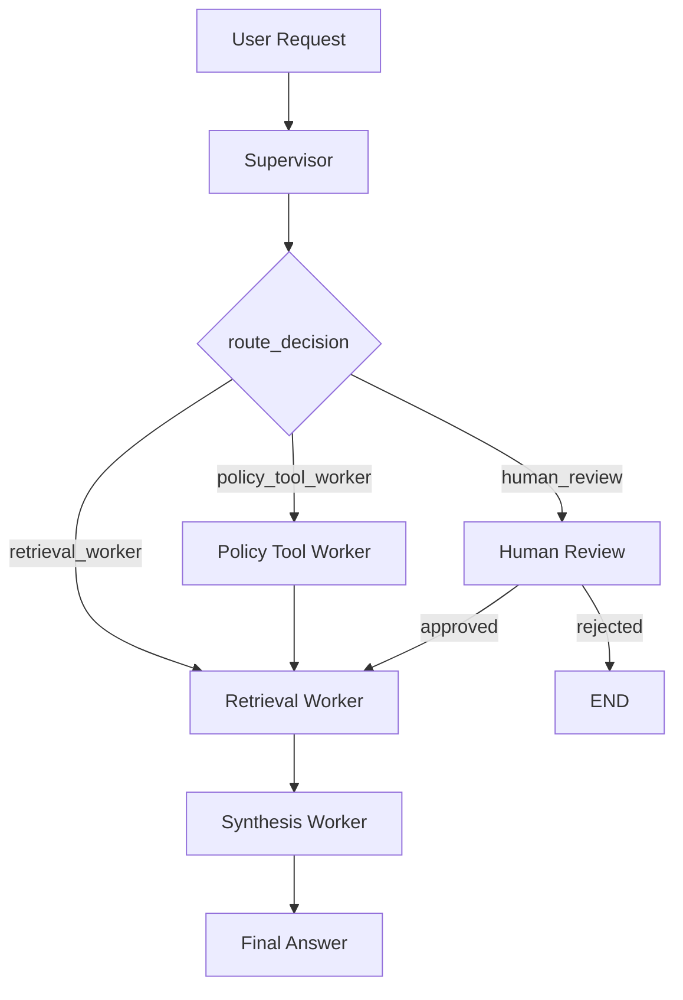

# System Architecture - Lab Day 09

**Nhóm:** 14  
**Ngày:** 2026-04-14  
**Version:** 1.0

---

## 1. Tổng quan kiến trúc

Hệ thống sử dụng pattern **Supervisor-Worker** với LangGraph để điều phối luồng xử lý câu hỏi nội bộ IT Helpdesk. Một `supervisor` đọc yêu cầu đầu vào, gán route phù hợp, sau đó chuyển state sang worker chuyên trách để xử lý truy xuất tri thức, phân tích policy, gọi MCP tools và tổng hợp câu trả lời cuối cùng.

**Pattern đã chọn:** Supervisor-Worker

**Lý do chọn pattern này thay vì single agent:**

- Tách rõ trách nhiệm giữa điều phối, retrieval, policy analysis và synthesis.
- Dễ trace bằng `history`, `workers_called`, `worker_io_logs`, `route_reason`.
- Có thể thêm capability mới bằng worker hoặc MCP tool mà không phải nhồi toàn bộ logic vào một prompt lớn.
- Hỗ trợ HITL thật qua `interrupt()` của LangGraph khi gặp case rủi ro cao.

---

## 2. Sơ đồ pipeline

### Sơ đồ thực tế của hệ thống

```text
User Request
    |
    v
+-------------------+
| supervisor_node   |
| - classify task   |
| - set route       |
| - set risk flags  |
+---------+---------+
          |
          v
   route_decision()
     /      |      \
    /       |       \
   v        v        v
retrieval  policy   human_review
worker     tool     node (HITL)
  |         |          |
  |         |          +--> interrupt -> resume/reject
  |         v
  |    optional MCP:
  |    - search_kb
  |    - get_ticket_info
  |         |
  +---------+
          |
          v
  retrieval_worker
          |
          v
  synthesis_worker
          |
          v
       Output
```

### Mermaid diagram



**Luồng chính đang được code trong `graph.py`:**

1. `START -> supervisor`
2. `supervisor -> retrieval_worker` cho câu hỏi tra cứu thông thường
3. `supervisor -> policy_tool_worker` cho câu hỏi liên quan policy / access / refund
4. `supervisor -> human_review` khi `risk_high=True` và task chứa `err-`
5. `policy_tool_worker -> retrieval_worker -> synthesis_worker -> END`
6. `retrieval_worker -> synthesis_worker -> END`

---

## 3. Vai trò từng thành phần

### Supervisor (`graph.py`)

| Thuộc tính | Mô tả |
|-----------|-------|
| **Nhiệm vụ** | Phân loại yêu cầu, xác định route, gắn cờ `needs_tool`, `risk_high`, chuẩn bị state ban đầu |
| **Input** | `task` từ user và `AgentState` khởi tạo bởi `make_initial_state()` |
| **Output** | `supervisor_route`, `route_reason`, `risk_high`, `needs_tool`, cập nhật `history` |
| **Routing logic** | Dựa trên keyword. Policy/access/refund -> `policy_tool_worker`; mặc định -> `retrieval_worker`; nếu rủi ro cao và có `err-` -> `human_review` |
| **HITL condition** | Task có từ khóa rủi ro như `p1`, `sev1`, `khẩn cấp` và đồng thời chứa mã lỗi `err-` |

### Retrieval Worker (`workers/retrieval.py`)

| Thuộc tính | Mô tả |
|-----------|-------|
| **Nhiệm vụ** | Semantic retrieval từ ChromaDB, trả về chunk liên quan và danh sách source |
| **Embedding model** | Ưu tiên `SentenceTransformer("BAAI/bge-m3")`; fallback sang OpenAI `text-embedding-3-small`; cuối cùng fallback random embedding cho test |
| **Vector store** | ChromaDB `PersistentClient(path="./chroma_db")`, collection `rag_lab` |
| **Top-k** | Mặc định `3`, lấy từ `retrieval_top_k` trong state nếu có |
| **Output chính** | `retrieved_chunks`, `retrieved_sources`, `worker_io_logs`, `history` |
| **Stateless?** | Có. Worker chỉ đọc state đầu vào và ghi kết quả vào state hiện tại |

### Policy Tool Worker (`workers/policy_tool.py`)

| Thuộc tính | Mô tả |
|-----------|-------|
| **Nhiệm vụ** | Phân tích policy dựa trên `task` và `retrieved_chunks`, đồng thời gọi MCP tools khi cần |
| **LLM dùng để phân tích** | OpenAI `gpt-4o-mini` với `response_format=json_object` |
| **Khi nào gọi MCP** | Nếu chưa có chunk và `needs_tool=True` thì gọi `search_kb`; nếu task chứa `ticket`, `p1`, `jira` thì gọi thêm `get_ticket_info` |
| **MCP tools gọi thực tế** | `search_kb`, `get_ticket_info` |
| **Output chính** | `policy_result`, `mcp_tools_used`, có thể cập nhật thêm `retrieved_chunks` |
| **Exception cases xử lý** | Bắt buộc kiểm tra `flash_sale_exception`, `digital_product_exception`, `activated_exception`; có ghi chú riêng cho policy v3 trước ngày `2026-02-01` |

### Synthesis Worker (`workers/synthesis.py`)

| Thuộc tính | Mô tả |
|-----------|-------|
| **Nhiệm vụ** | Tổng hợp câu trả lời cuối cùng từ evidence retrieval và policy context |
| **LLM model** | Ưu tiên OpenAI `gpt-4o-mini`; fallback Gemini `gemini-1.5-flash`; nếu lỗi thì trả về thông báo synthesis error |
| **Temperature** | `0.1` khi dùng OpenAI |
| **Grounding strategy** | Ghép toàn bộ `retrieved_chunks` + `policy_result.exceptions_found` vào context; system prompt yêu cầu chỉ trả lời dựa trên tài liệu cung cấp và phải cite nguồn |
| **Abstain condition** | Nếu context không đủ, prompt yêu cầu trả lời rõ "Không đủ thông tin trong tài liệu nội bộ" |
| **Output chính** | `final_answer`, `sources`, `confidence`, `worker_io_logs`, `history` |

### MCP Server (`mcp_server.py`)

| Tool | Input | Output |
|------|-------|--------|
| `search_kb` | `query`, `top_k` | `chunks`, `sources`, `total_found` |
| `get_ticket_info` | `ticket_id` | Thông tin ticket mock hoặc lỗi không tìm thấy |
| `check_access_permission` | `access_level`, `requester_role`, `is_emergency` | `can_grant`, `required_approvers`, `notes`, `source` |
| `create_ticket` | `priority`, `title`, `description` | Ticket mock mới với `ticket_id`, `url`, `status` |

---

## 4. Shared State Schema

`AgentState` trong `graph.py` là contract dữ liệu đi xuyên suốt toàn bộ graph.

| Field | Type | Mô tả | Ai đọc/ghi |
|-------|------|-------|-----------|
| `task` | `str` | Câu hỏi đầu vào từ user | Supervisor đọc, mọi worker đọc |
| `route_reason` | `str` | Giải thích lý do route | Supervisor ghi, human review cập nhật |
| `risk_high` | `bool` | Cờ rủi ro cao | Supervisor ghi, human review đọc |
| `needs_tool` | `bool` | Có cần gọi tool ngoài hay không | Supervisor ghi, policy worker đọc |
| `hitl_triggered` | `bool` | Có đi qua bước human review hay chưa | Human review ghi |
| `retrieved_chunks` | `list[dict]` | Các chunk evidence retrieve được | Retrieval ghi, policy/synthesis đọc |
| `retrieved_sources` | `list[str]` | Tên file nguồn của retrieval | Retrieval ghi, synthesis có thể đọc gián tiếp |
| `policy_result` | `dict` | Kết quả phân tích policy | Policy worker ghi, synthesis đọc |
| `mcp_tools_used` | `list` | Danh sách kết quả các MCP calls đã thực hiện | Policy worker ghi |
| `human_decision` | `dict` | Quyết định approve/reject từ reviewer | Human review ghi |
| `final_answer` | `str` | Câu trả lời cuối cho user | Synthesis ghi |
| `sources` | `list[str]` | Nguồn được cite ở output | Synthesis ghi |
| `confidence` | `float` | Mức độ tin cậy của câu trả lời | Synthesis ghi |
| `history` | `list[str]` | Log tuyến tính toàn bộ các bước trong run | Supervisor và mọi worker ghi |
| `workers_called` | `list[str]` | Danh sách node/worker đã chạy | Mọi worker và human review ghi |
| `supervisor_route` | `str` | Route được supervisor chọn | Supervisor ghi, `route_decision()` đọc |
| `latency_ms` | `Optional[int]` | Tổng thời gian xử lý của run | `synthesis_worker_node` hoặc human review ghi |
| `run_id` | `str` | ID của run/thread để resume graph | `make_initial_state()` ghi, human review dùng |
| `started_at_ms` | `Optional[int]` | Timestamp bắt đầu run | `make_initial_state()` ghi, graph dùng để tính latency |

Ngoài `AgentState`, code còn dùng thêm field động:

- `worker_io_logs`: log input/output/error cho từng worker, phục vụ trace/debug.
- `retrieval_top_k`: nếu được gắn vào state thì override top-k mặc định của retrieval worker.
- `__interrupt__`: chỉ xuất hiện ở kết quả LangGraph khi graph bị pause tại human review.

---

## 5. Lý do chọn Supervisor-Worker so với Single Agent (Day 08)

| Tiêu chí | Single Agent (Day 08) | Supervisor-Worker (Day 09) |
|----------|----------------------|--------------------------|
| Debug khi sai | Khó, khó xác định lỗi nằm ở prompt hay tool use | Dễ hơn, có thể test `retrieval`, `policy_tool`, `synthesis` độc lập |
| Thêm capability mới | Phải sửa prompt lớn hoặc nhét thêm logic trong agent chính | Chỉ cần thêm worker mới hoặc MCP tool mới |
| Routing visibility | Thấp | Cao, có `supervisor_route`, `route_reason`, `history` |
| Human-in-the-loop | Thường mô phỏng thủ công | Có `interrupt()` và `resume_graph()` thật |
| Traceability | Chủ yếu xem output cuối | Có `worker_io_logs`, `workers_called`, trace JSON |
| Khả năng mở rộng | Dễ bị prompt phình to | Mở rộng tốt hơn theo module |

**Quan sát từ code lab hiện tại:**

- Hệ thống đang ưu tiên tính module hóa và demo rõ luồng orchestration hơn là tối ưu logic từng worker.
- `policy_tool_worker` và `retrieval_worker` có thể cùng tham gia trong một run, giúp câu trả lời cuối có cả policy reasoning lẫn evidence retrieval.
- MCP server tách riêng khỏi graph nên có thể thay mock data bằng backend thật mà không cần đổi cấu trúc orchestration.

---

## 6. Giới hạn và điểm cần cải tiến

1. `policy_tool_worker` chạy trước `retrieval_worker` trên nhánh policy, nên retrieval cuối có thể ghi đè `retrieved_chunks` mà policy worker vừa lấy từ MCP `search_kb`.
2. `mcp_tools_used` được khai báo trong `AgentState` là `list[str]` nhưng thực tế code append các object dict chi tiết; type contract hiện chưa khớp implementation.
3. `analyze_policy()` có schema prompt chứa `refund_allowed`, nhưng object `policy_result` trả về lại không giữ field này, làm mất một phần kết luận policy.
4. Retrieval đang phụ thuộc ChromaDB local `./chroma_db`; nếu collection chưa có dữ liệu thì hệ thống chỉ trả về rỗng hoặc mock fallback.
5. Synthesis phụ thuộc API key cho OpenAI hoặc Gemini; nếu thiếu key thì output chỉ là thông báo lỗi, chưa có chế độ rule-based fallback hữu ích.
6. Supervisor hiện route bằng keyword heuristic, nên dễ bỏ sót intent phức tạp hoặc route sai khi câu hỏi dùng từ ngữ khác dự kiến.

---

## 7. Kết luận

Kiến trúc hiện tại là một hệ **Supervisor-Worker + MCP + HITL** khá rõ ràng cho bài lab Day 09:

- `graph.py` chịu trách nhiệm orchestration và persistence theo `run_id`
- `retrieval.py` chịu trách nhiệm lấy evidence từ vector DB
- `policy_tool.py` chịu trách nhiệm policy reasoning và tool calling
- `synthesis.py` chịu trách nhiệm sinh câu trả lời grounded
- `mcp_server.py` cung cấp lớp tool bên ngoài cho KB, ticket và access control

Điểm mạnh lớn nhất của kiến trúc này là **dễ quan sát, dễ mở rộng, dễ test từng phần**. Điểm cần cải tiến lớn nhất là **chuẩn hóa state contract và đồng bộ lại flow giữa policy worker với retrieval worker** để tránh mất dữ liệu trung gian.
